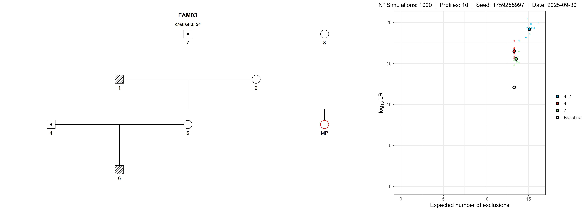

# 🧬 PedigreeTypingPriority

--------------------------------------------------------------------------------

## 🔍 Introduction

**When budgets, logistics, and sample quality are limited, you can’t type everyone.**  
In many MPI/DVI and kinship investigations, deciding **which relative to prioritize**—whether 
a fresh blood sample or a bone sample that may require an exhumation—has real operational and ethical costs. 
This toolkit helps you make that decision with **simulation-based evidence**: it estimates how much each candidate 
(or combination of candidates) is likely to improve identification power before you commit resources.

Use it as a quick, practical guide to **decide who to type next**—so you get the most evidential value **with the least time and cost**.

--------------------------------------------------------------------------------

## 📋 Requirements

- **Genetic Data**: To perform the simulations, it is necessary to
    have a pre-configured `Familias3` file containing the _Frequency Table_ (STR/SNP) 
    and _Family Pedigrees_. 
    To install the required software, go to this link: [Familias3](https://familias.no/)

- **R version 4.2.0 or higher**.

--------------------------------------------------------------------------------

## 🛠 Installation & Setup

1. **Download manually** or **clone the repository**.
   ```bash
   git clone https://github.com/sbiagini0/PedigreeTypingPriority.git
   cd PedigreeTypingPriority
   ```
2. **Open the project in RStudio**
    - Double-click on `PedigreeTypingPriority.Rmd`.

3. **Install the required packages**
    - Run the first code chunk in PedigreeTypingPriority.Rmd; it detects missing libraries, installs them, and loads them.
    To install manually:
   ```bash
   install.packages(c("pedFamilias","pedtools","forrel","ggplot2","magick","svDialogs","parallel","knitr","rmarkdown"))
   ```
--------------------------------------------------------------------------------

## ⚙️ Configuring and Running the Simulation

1. **Prepare your input file**  
    - Place a _DVI/MPI_ `.fam` file in the `data/` folder (any filename).

2. **Run all chunks in order**  
    - The script will prompt GUI dialogs when needed.

    2.1 **Read & format the `.fam`**  
    - Import a single Familias file and standardize `ped` objects for analysis.

    2.2 **Pick a pedigree**  
    - Choose the specific pedigree to analyze.

    2.3 **Pedigree Edit (optional)**  
    - Interactively adjust the chosen pedigree to add parents and/or children.

       2.3.1) **Add parents:**  
       - Shows the current **founders** as selectable candidates to add parents to.  
       - Asks for `Father name` and `Mother name`.  
       - Adds parents and re-plots the pedigree.

       2.3.2) **Add child:**  
       - Lets you pick an existing father (males) and mother (females) **or** choose *“Not listed (type a new one)”* to create new parents.  
       - Prompts for `Child name` and `Child sex` (`0` unknown, `1` male, `2` female).  
       - Adds the child and re-plots the pedigree.

       2.3.3) **Finish**  
       - Loops until **“Finish”**, then returns the **updated `ped`**.

    2.4 **Select untyped members**  
    - Choose the member(s) to virtually type.

    2.5 **Setting Simulation Parameters**  
    - Collect all simulation settings:

      - `nsim` — number of LR simulations per selection set.  
      - `nprofiles` — simulated profiles per LR simulation.  
      - `baseline` — include baseline pedigree in comparisons.  
      - `mutations` — `NA` = **Deactivate only where genotypes consistent**; `TRUE` = **Deactivate mutations**; `FALSE` = **Keep mutations**)
      - `threshold` — inclusion threshold for IP in `MPPsims`.  
      - `ncores` — CPU cores for parallel runs.  
      - `seed` — seed for reproducibility.

    2.6 **Main function — `typingPriority(...)`**  
    - Run all simulations, build plots, and export the composite image.

      - **Build selection sets** with  
        `generate_combinations(members_selected = mids, typedMembers = pedtools::typedMembers(ped), k_max = NULL)`  
        Creates all combinations of candidates (or up to `k_max`) and appends currently typed members not in each combination.  
        Names each set by the candidate combination.

      - **Console preview**  
        Prints a box summarizing total sets and `k_max`, followed by one line per selection set.

      - **Simulations** via `forrel::MPPsims(...)`

      - **Plots & export**  
        • **Power plot**: `forrel::powerPlot(simData, type = 3)` with subtitle (nsim, profiles, seed, date).  
        • **Pedigree plot**: `plot(ped, ...)` highlighting the selected member(s).  

      - **Composite**  
        Writes the final file to: `Output/<FAMID>_PedigreeTypingPriority.jpeg`.  
        Cleans temporary subfolders (`Output/Pedigree plot/` and `Output/Simulation plot/`).

3. **Review outputs**  
   - The `Output/` folder contains files for each family pedigree selected.

--------------------------------------------------------------------------------

## 🖼️ A toy MPI example

The `toy_MPI.fam` file included in this repository is a simplified
example representing a basic scenario of genetic pedigree.
This file includes a **Population Frequency Table** from South America with 24 STR markers, with 15 Family Pedigrees to be evaluated.

For example, for the *FAM03* pedigree, there are two candidate strategies to improve identification power:

- **(4)** Typing a **full sibling of the MP**.  
- **(7)** Typing the **maternal–paternal great-grandfather of the MP** (added to the pedigree using the `edit_pedigree()` step because he was not present in the original file).

#### Setting Simulation Parameters

- **nsim:** `1000`
- **nprofiles:** `10`
- **baseline:** `TRUE`
- **mutations:** `FALSE` *(mutations enabled)*
- **threshold:** `10000`
- **ncores:** `10`
- **seed:** `1759252024`



### Interpretation

- **Typing both 4 and 7**
  - `4_7`: points cluster at the **highest** `log10 LR` (~19.5–20.5) and the **highest** `expected exclusions` (~15–16).
  
- **Typing only one of them**
  - `4`: `log10 LR` ≈ **16.5–17.5**; `expected exclusions` ≈ **14–15**.
  - `7`: `log10 LR` ≈ **15.5–16.5**; `expected exclusions` ≈ **13–14**.

- **Baseline**
  - `log10 LR` ≈ **12–13** with `expected exclusions` ≈ **13** (notably lower than any typing strategy).

**Recommendation:**  
If resources allow, **typing all available candidate relatives is always the optimal strategy**—it maximizes both `log10 LR` and `expected exclusions`.

If you can type just one relative, **type the full sibling (4)**.  
If you can type two, **type both (4_7)** to maximize `log10 LR` and `expected exclusions`.

--------------------------------------------------------------------------------

## 📚 Citations

### mispitools package
- **Marsico et al.** (2023). *Forensic Science International: Genetics*. https://doi.org/10.1016/j.fsigen.2023.102891  
- **Marsico et al.** (2021). *Forensic Science International: Genetics*. https://doi.org/10.1016/j.fsigen.2021.102519  
- **Marsico** (2024). *bioRxiv*. https://doi.org/10.1101/2024.08.16.608307

### pedsuite package (pedtools, forrel, pedFamilias)
- **Vigeland, M. D.** (2020). *Pedigree Analysis in R*. Academic Press. https://doi.org/10.1016/C2020-0-01956-0

--------------------------------------------------------------------------------

## 📝 License

MIT License — see [LICENSE](LICENSE) for details.

--------------------------------------------------------------------------------
